# Personal Task Manager

A modern Flutter application for managing personal tasks with seamless Firebase integration.

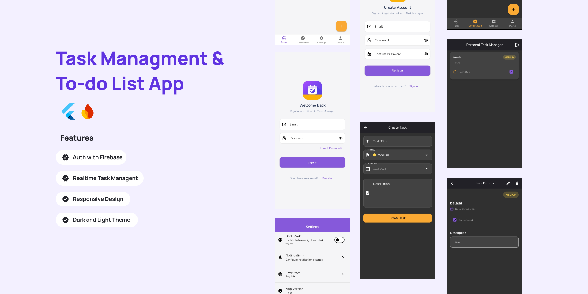

## 📺 Demo

[](https://www.youtube.com/watch?v=6mpTsdOo7ho)


## ✨ Features

- **User Authentication**
  - Email/Password sign in and registration
  - Password reset functionality
  - Persistent login state

- **Task Management**
  - Create, read, update, and delete tasks
  - Priority-based organization (Low, Medium, High)
  - Task completion tracking
  - Deadline management
  - Real-time updates

- **UI/UX**
  - Responsive design
  - Dark/Light theme support
  - System theme integration
  - Persistent theme settings
  - Shimmer loading effects

## 🛠️ Tech Stack

- Flutter 3.7.0
- Firebase (Authentication, Firestore)
- Provider State Management
- Shared Preferences
- Flutter Secure Storage
- Google Fonts
- Shimmer

## 🚀 Getting Started

### Prerequisites

- Flutter SDK
- Firebase project
- Android Studio / VS Code
- Git

### Installation

1. Clone the repository:

   ```bash
   git clone git@github.com:IlhamGhaza/task_app.git
   cd task_app
   ```

2. Install dependencies:

   ```bash
   flutter pub get
   ```

3. Configure Firebase:
   - Add your `google-services.json` for Android and `GoogleService-Info.plist` for iOS
   - Configure Firebase options in `lib/firebase_options.dart`

4. Run the app:

   ```bash
   flutter run
   ```

## 📁 Project Structure

```
lib/
├── core/                # Core functionality
│   ├── theme/           # App theming
│   └── widget/          # Reusable widgets
├── data/                # Data layer
│   ├── model/           # Data models
│   └── service/         # API services
└── presentation/        # UI layer
    ├── account/         # Account screens
    ├── auth/            # Authentication screens
    └── home/            # Home and task screens
```

## 🔥 Firebase Configuration

### Firestore Rules

```javascript
rules_version = '2';
service cloud.firestore {
  match /databases/{database}/documents {
    match /tasks/{taskId} {
      allow read, update, delete: if request.auth != null && request.auth.uid == resource.data.userId;
      allow create: if request.auth != null && request.auth.uid == request.resource.data.userId;
    }
  }
}
```

## 📸 Screenshots

Light Theme
<div style="display: flex; flex-wrap: wrap; gap: 10px; justify-content: center;">
  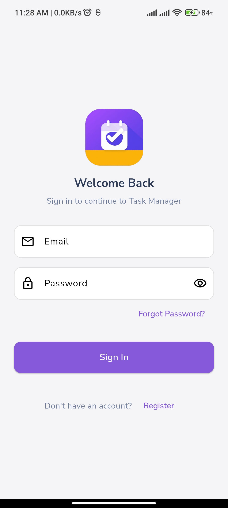
  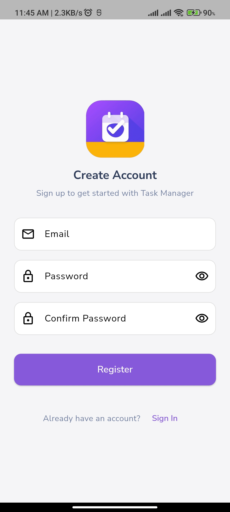
  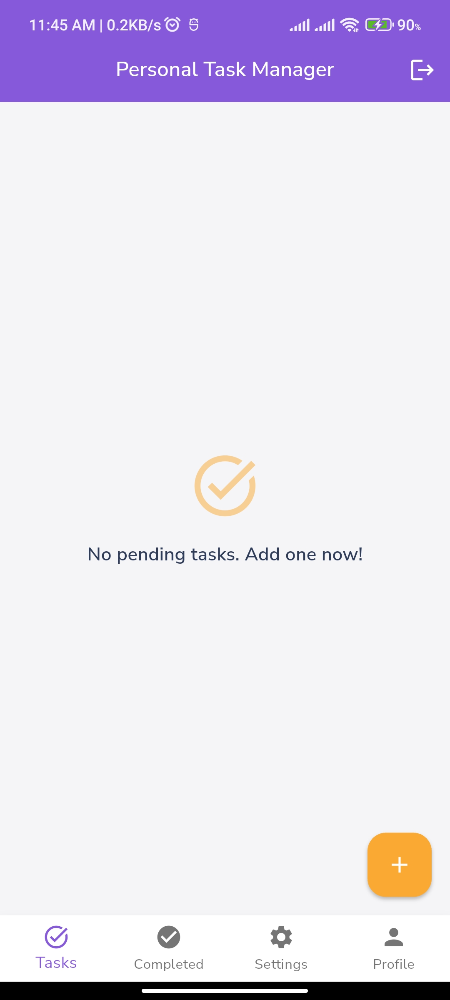
  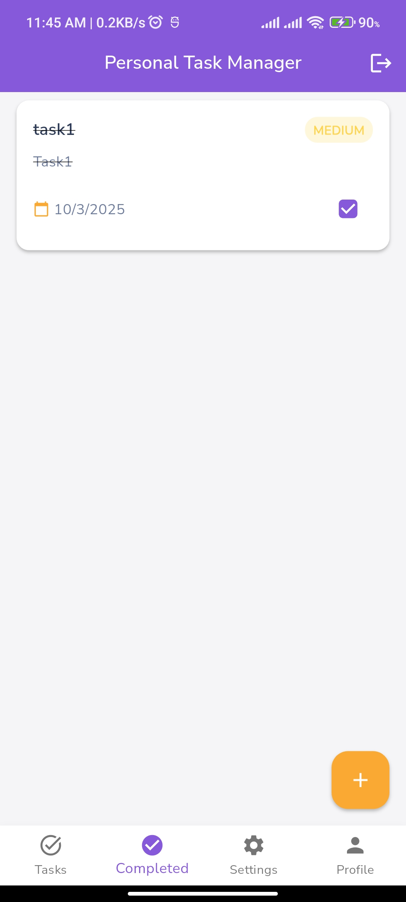
  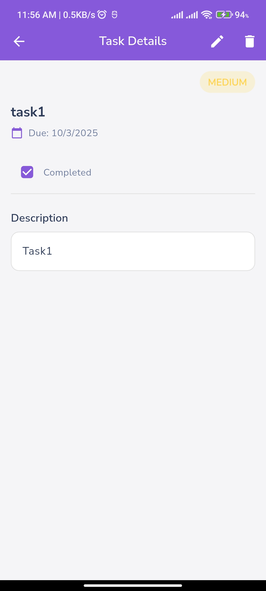
  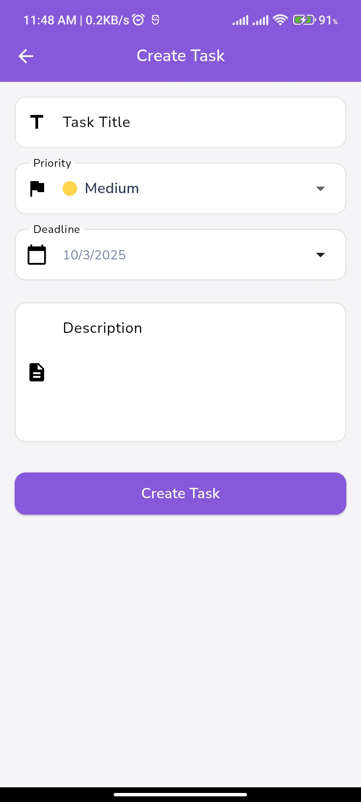
  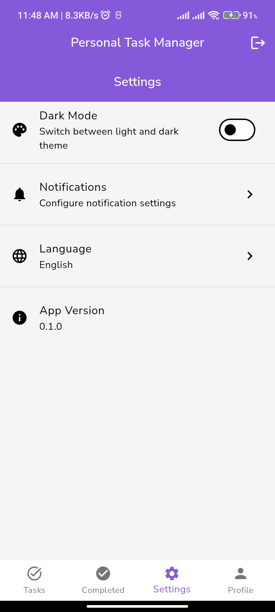
</div></br>

Dark Theme
<div style="display: flex; flex-wrap: wrap; gap: 10px; justify-content: center;">
  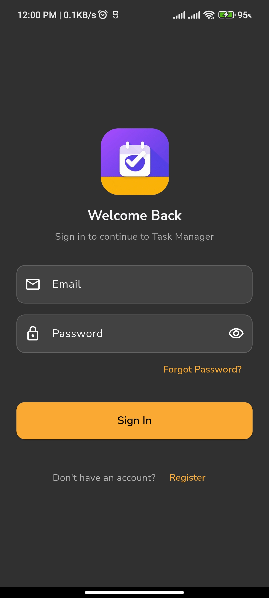
  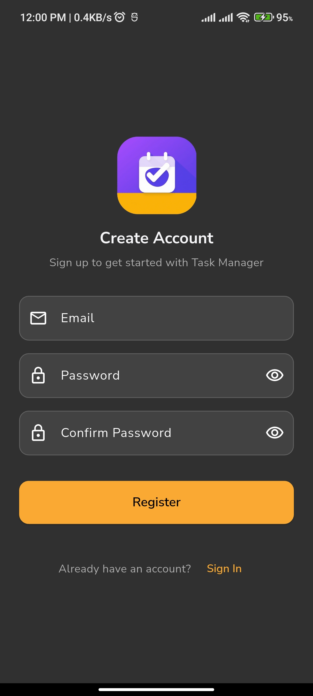
  
  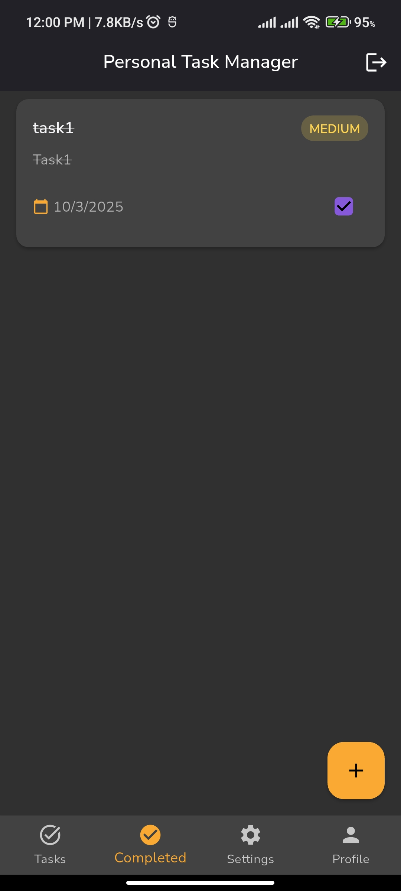
  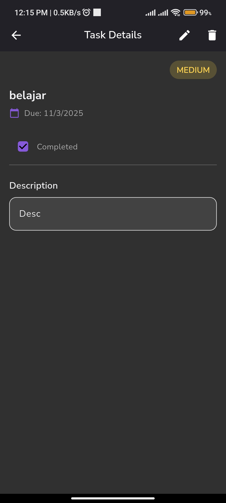
  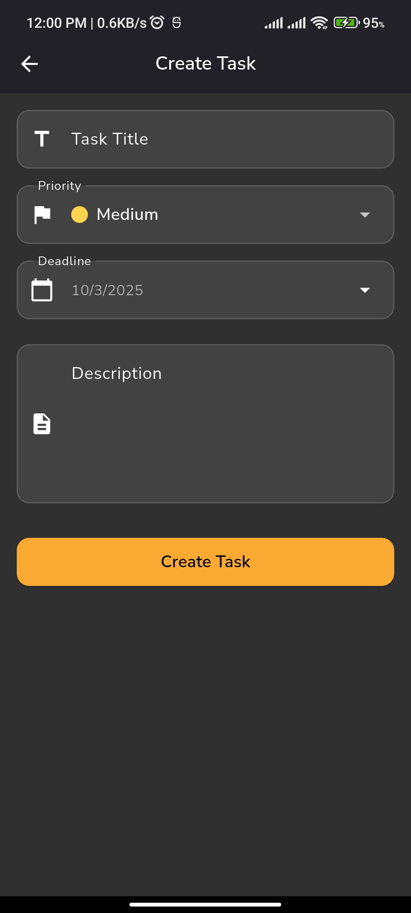
  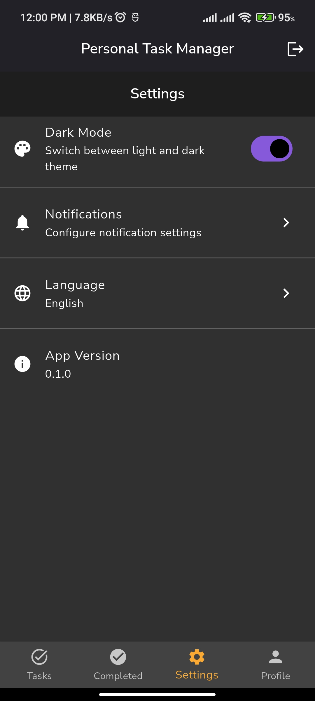
</div></br>

## 📦 Dependencies

```yaml
dependencies:
  flutter:
    sdk: flutter
  cloud_firestore: ^5.6.5
  firebase_auth: ^5.5.1
  firebase_core: ^3.12.1
  flutter_secure_storage: ^9.2.4
  google_fonts: ^6.2.1
  provider: ^6.1.2
  shared_preferences: ^2.5.2
  shimmer: ^3.0.0
  intl: ^0.18.1
  flutter_svg: ^2.0.7
```

## 🔨 Development

### Building for Release

```bash
# Android
flutter build apk --release

# iOS
flutter build ios --release
```

### Code Style

We follow the official [Flutter style guide](https://flutter.dev/docs/development/tools/formatting).

```bash
# Format code
flutter format .

# Analyze code
flutter analyze
```

## 🤝 Contributing

Contributions are welcome! Please feel free to submit a Pull Request.

1. Fork the repository
2. Create your feature branch (`git checkout -b feature/amazing-feature`)
3. Commit your changes (`git commit -m 'Add some amazing feature'`)
4. Push to the branch (`git push origin feature/amazing-feature`)
5. Open a Pull Request

## 📄 License

[](https://opensource.org/licenses/MIT)

This project is licensed under the MIT License - see the [LICENSE](LICENSE) file for details.

## 📞 Contact

Ilham Ghaza
- GitHub: [@IlhamGhaza](https://github.com/IlhamGhaza)
- Email: cb7ezeur@selenakuyang.anonaddy.com (forwarded to personal email)
- LinkedIn: [Your LinkedIn](https://www.linkedin.com/in/muhammadilhamghazali/)

## ⭐ Show your support

Give a ⭐️ if this project helped you!